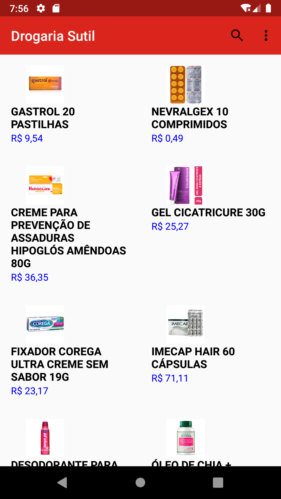
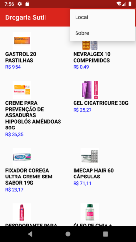
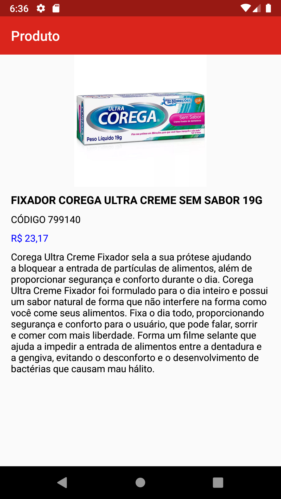
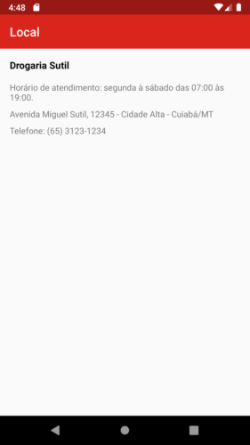
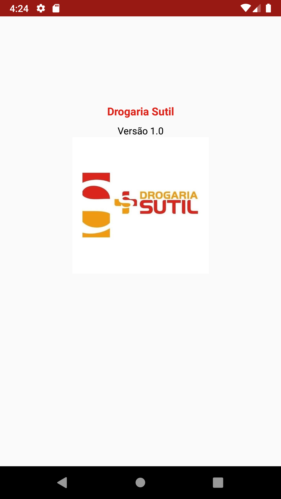

# Catálogo Digital - App Android Java + Web Service Restful Node.js + XAMPP

## Screenshots

## Web Service Restful Node.js

[Clique aqui para ver o web service restful](https://github.com/nwsdias/web-service-restful)
